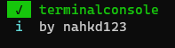

# 
## Demo
[](https://asciinema.org/a/XuUGU5yCUCMmGhSc2K6PQ6qGw)
## Usage
```ts
let { TerminalConsole } = require("terminalconsole");

let con = new TerminalConsole();
con.on("line", line => {
    doSomething(line);
});
```

## Build & Test
```console
$ npm run build

> terminalconsole@0.0.1 build /terminalconsole
> tsc -b

```